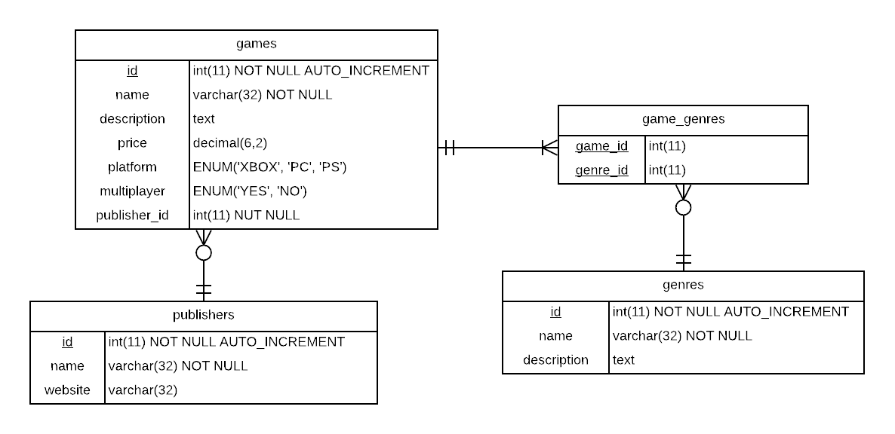

# ER Diagrams

## Understanding ER Diagrams

Take a look at the physical ER diagram shown below. The diagram should contain all information needed to effectively implement a new database. Convert the information that is contained in the ER diagram to create some SQL queries that will create all the tables.



```sql

```

<!-- TODO: add or remove sql code blocks if necessary. -->

## Creating ER Diagrams

Inspect the `forta` database. Try to figure out what the columns and properties are for the tables `vendors` and `products`. Convert the columns, an properties into ER Diagrams using Lucid Chart. Provide the **conceptual**, **logical** and **physical** ER diagram for both tables. Do no not forget to define the **relation** and the **minimum and maximum cardinality**. Use crow foot notation in all diagrams.

Save a _png_ version of your diagrams inside the `img` directory.

You can use [Lucidchart.com](https://www.lucidchart.com) to draw the diagrams.

### Conceptual diagram

<!-- TODO: insert the image here -->
<!--  -->

### Logical diagram

<!-- TODO: insert the image here -->
<!--  -->

### Physical diagram

<!-- TODO: insert the image here -->
<!--  -->

## Designing an ER diagram

A webshop wants to improve and automate selling smartphones using there website. To achieve this they need have a database that will contain all the information about the phones.

If we take a look at there current webpage, we can see that smartphones have multiple properties: name, camera quality, battery prestation, screen size, price, and availability (green vs blue shopping icon), number of reviews.

It is your job to design a database that can manage the data needed to be shown on the webpage. You only need to create a physical ER diagram.


### Physical diagram

<!-- TODO: insert the image here -->
<!--  -->

## Report

When you are ready and submitted the exercise, make sure to fill in the [report](./REPORT.md) file. Don't forget to commit it as well. Answer all questions and check the formatting by viewing the file on GitHub.
