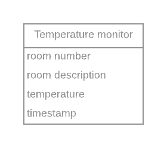

# Normalization

Below you will be presented some ER diagrams for a possible database design. The designs might not be normalized. It is your task to normalize the database designs so that the data can be stored correctly without any problems reading, updating, inserting or deleting any data. Every design should be at least in **2NF**.

If needed, or if it results in a better design, the properties in your proposal can be renamed to a more suited name.

If there should exist many-to-many relations, please describe the association table as well.

All solutions can be presented using _logical ER_ diagrams.

Describe the steps you followed to get the database in NF1 and NF2.

You can use [Lucidchart.com](https://www.lucidchart.com) to draw the diagrams.

## Temperature sensor database

This database should hold a log of different temperature values that are measured every 10 minutes. The database should support multiple sensors that are placed in different rooms. Each room has a number (eg: 02.85) and a description (eg: Labo embedded software).

### Converting to the first normal form (NF1)

<!-- TODO: describe the steps you followed and show the resulting ER diagram -->

### Converting to the first normal form (NF2)

<!-- TODO: describe the steps you followed and show the resulting ER diagram -->

## Netflix database

This database should hold a list of movie titles and users. Every user should be able to mark if a movie belongs to his favorites or not. Movies and users without favorite marks should be allowed to be stored.

### Converting to the first normal form (NF1)

<!-- TODO: describe the steps you followed and show the resulting ER diagram -->

### Converting to the second normal form (NF2)

<!-- TODO: describe the steps you followed and show the resulting ER diagram -->

## Study program database

This database should hold a list of students and the courses that they can follow. For both the students and courses we want to store additional information.

### Converting to the first normal form (NF1)

<!-- TODO: describe the steps you followed and show the resulting ER diagram -->

### Converting to the second normal form (NF2)

<!-- TODO: describe the steps you followed and show the resulting ER diagram -->

## Report

When you are ready and submitted the exercise, make sure to fill in the [report](./REPORT.md) file. Don't forget to commit it as well. Answer all questions and check the formatting by viewing the file on GitHub.
