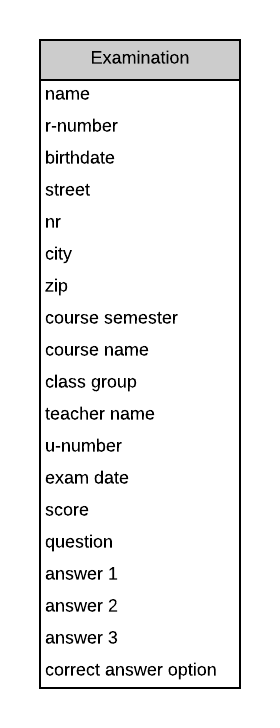

# Normalization and ER-diagram

Take a look at the following ER diagram.

The ER-diagram describes a possible database design for managing students, examinations and scores. The database design is not normalized. Try to normalize this database to NF2.

You can use [Lucidchart.com](https://www.lucidchart.com) to draw the diagrams.

Describe the steps you need to follow to get the database in NF1 and NF2.

## Normalizing the database

### Converting to the first normal form (NF1)

<!-- TODO: describe the steps you followed and show the resulting ER diagram -->

### Converting to the first normal form (NF2)

<!-- TODO: describe the steps you followed and show the resulting ER diagram -->

## ER-diagrams

For the normalized database, create an **conceptual**, **logical** and **physical** ER diagram.

### Conceptual ER-diagram

<!-- TODO: Place your solution image here -->

### Logical ER-diagram

<!-- TODO: Place your solution image here -->

### Physical ER-diagram

<!-- TODO: Place your solution image here -->

## Report

When you are ready and submitted the exercise, make sure to fill in the [report](./REPORT.md) file. Don't forget to commit it as well. Answer all questions and check the formatting by viewing the file on GitHub.
