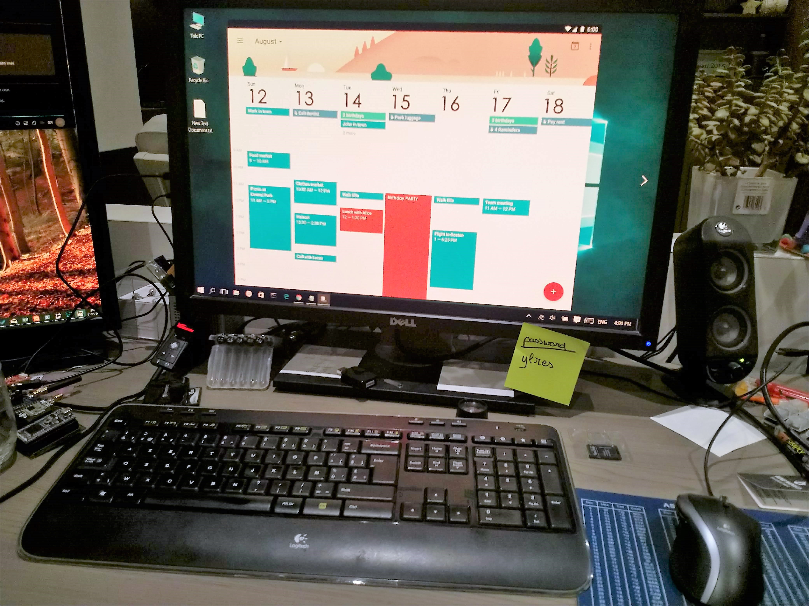

# Hacking a Database

Try to imagine that you are a hacker. You need to get access to a database to retrieve some critical information from a manager of a company. You don't know his password, but in a clever way you received some information of an inside man.

The inside man managed to get access to some desks of the employees. He had not much time, and could not access the computer without being noticed. Instead he used a hidden camera to get a snapshot of an employees desk. We do not know who the employee is or what his job is. The only thing we know is that the employee works for the manager that is our target.

 (download and show fullscreen for all details)

You did some research before, and you already retrieved some information about the servers and network. On the website of the company you found some information that could help you. There you found that 'Uwe Garnier' is a guy working at the IT support that maintains the servers. Some quick tests revealed that he has an account `garnieruwe` to the database server with an insecure password `passw0rd`. [25 most popular passwords of 2017](https://gizmodo.com/the-25-most-popular-passwords-of-2017-you-sweet-misgu-1821425092)

The hostname of the database server is `hacking-a-database.devbitapp.be` and the port is `38832`.

Note that the database server is an old machine that is getting a bit slow. A lot of data is in that database, so you will need to limit your query results. Not only do you want to prevent an overwhelming load of data, you do not want to load the server to much. This will show in the logs, and the IT department might notice that something is wrong. You might get caught if you are not careful!

To succeed in your quest, you must get the following information:

* `username`
* `password`

The information belongs to the manager of the employee.

With the username and password, you can connect to the same database server again, and insert **your full name** in the table `managers_only`.

## Solution

Give all your queries, and the steps you followed to get the solution. Describe your thinking!

<!-- TODO: REPLACE WITH YOUR QUERIES, STEPS and THINKING -->

## Report

When you are ready and submitted the exercise, make sure to fill in the [report](./REPORT.md) file. Don't forget to commit it as well. Answer all questions and check the formatting by viewing the file on GitHub.
